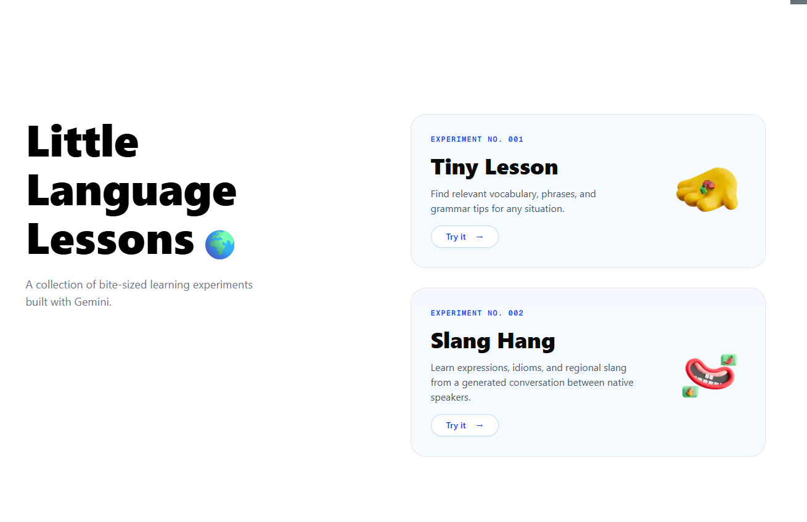
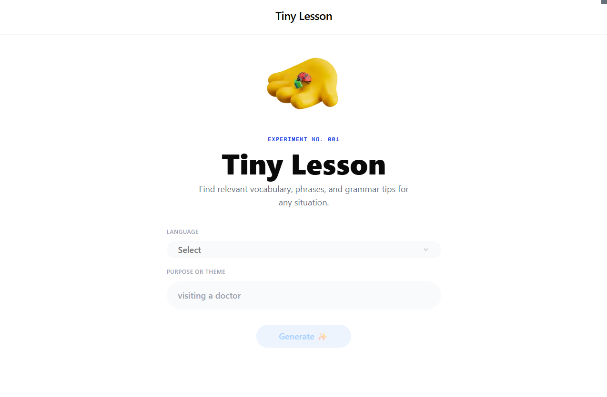
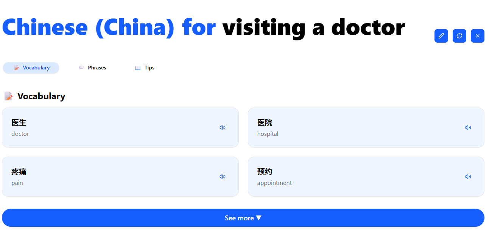
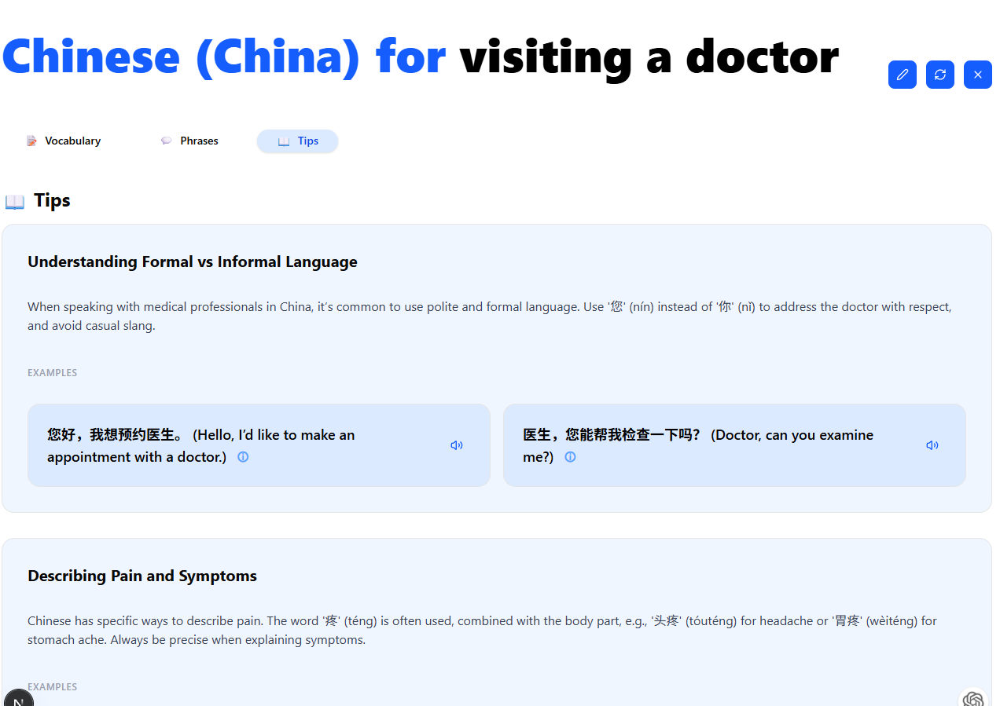
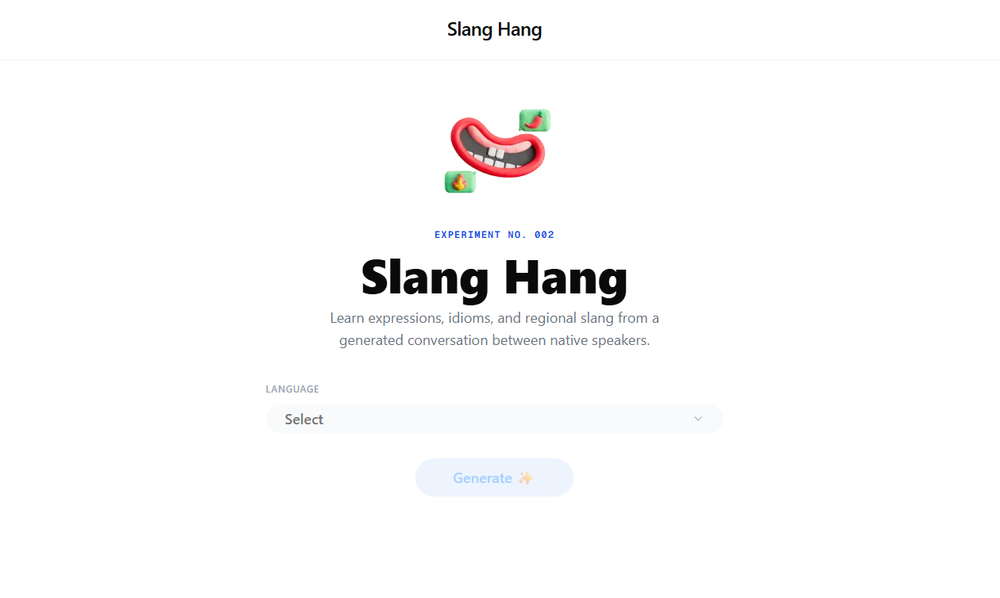
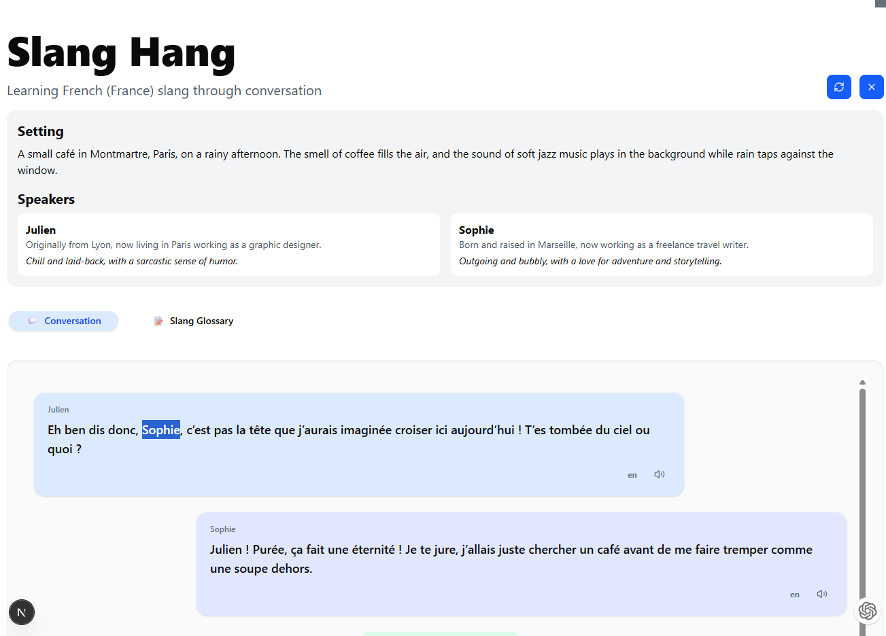
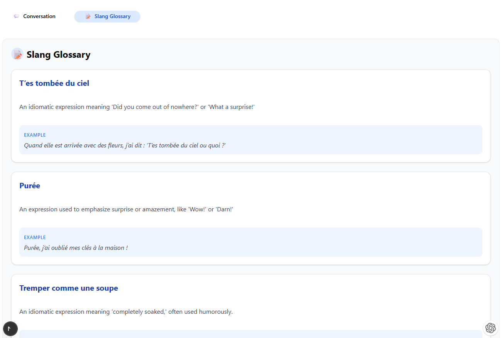

# Little Language Lessons Clone

This project is a clone of Google's [Little Language Lessons](https://labs.google/lll/en/experiments), a collection of bite-sized language learning experiments originally built with Gemini.

[](https://github.com/yourusername/little-language-lessons-clone/actions/workflows/ci.yml)
[](https://opensource.org/licenses/MIT)
[](https://nextjs.org/)
[](http://makeapullrequest.com)
[](https://vercel.com/new/clone?repository-url=https://github.com/yujingr/Google-Little-Language-Lessons)

> **Note:** A video fully process on how this was created using Cursor AI will be released later. This took ~3 hours including all the steps from setup to completion.

## Screenshots

### Home Page



### Tiny Lesson





### Slang Hang





## Implemented Experiments

1. **Tiny Lesson**: Find relevant vocabulary, phrases, and grammar tips for any situation.
2. **Slang Hang**: Learn expressions, idioms, and regional slang from a generated conversation between native speakers.

## Tech Stack

- **Next.js**: React framework for the frontend
- **OpenAI API**: For generating language learning content
- **shadcn/ui**: UI component library
- **Google Translate TTS**: Unofficial API for text-to-speech functionality

## Setup Instructions

1. Clone the repository:

   ```
   git clone https://github.com/yourusername/little-language-lessons-clone.git
   cd little-language-lessons-clone
   ```

2. Install dependencies:

   ```
   npm install
   ```

3. Create a `.env.local` file in the root directory with the following variables:

   ```
   # AI model name to use
   AI_MODEL_NAME=gpt-4o

   # Base URL for the AI service API | use openai or compatible api
   AI_BASE_URL=https://api.openai.com/v1

   # Your API key for the AI service
   AI_API_KEY=your_api_key_here
   ```

4. Run the development server:

   ```
   npm run dev
   ```

5. Open [http://localhost:3000](http://localhost:3000) with your browser to see the result.

## Environment Variables

- `AI_MODEL_NAME`: model to use (recommend gpt-4o or better)
- `AI_BASE_URL`: Base URL for the OpenAI compatible API endpoint
- `AI_API_KEY`: Your API key for accessing the OpenAI service

## Features

### Tiny Lesson

- Select a language and specify a topic/purpose
- Get vocabulary, useful phrases, and language tips related to your chosen topic
- Text-to-speech functionality to hear correct pronunciation

### Slang Hang

- Experience a realistic conversation between native speakers
- Learn authentic slang, idioms, and colloquial expressions
- Each conversation includes a glossary of slang terms with definitions and examples

## TODO

- [ ] Implement Experiment 3 from the original Little Language Lessons

## License

This project is for educational purposes only. The original Little Language Lessons is a product of Google Labs.
